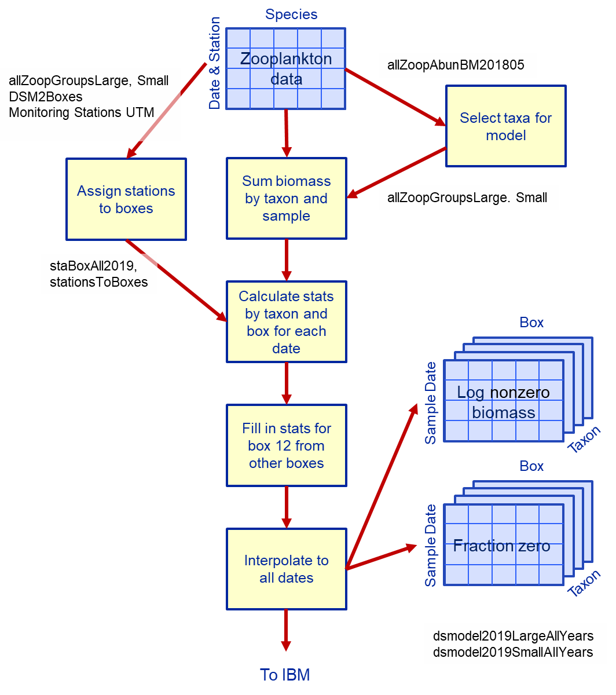
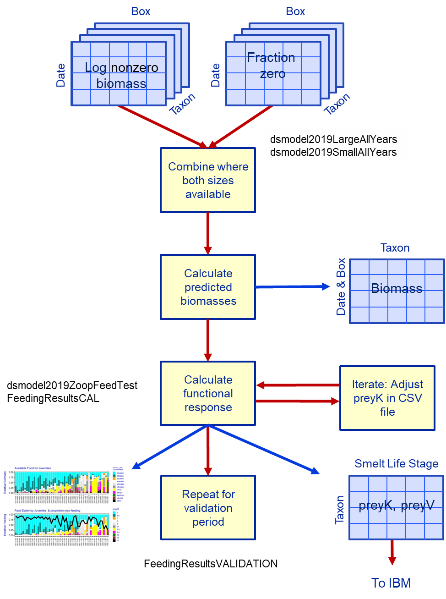
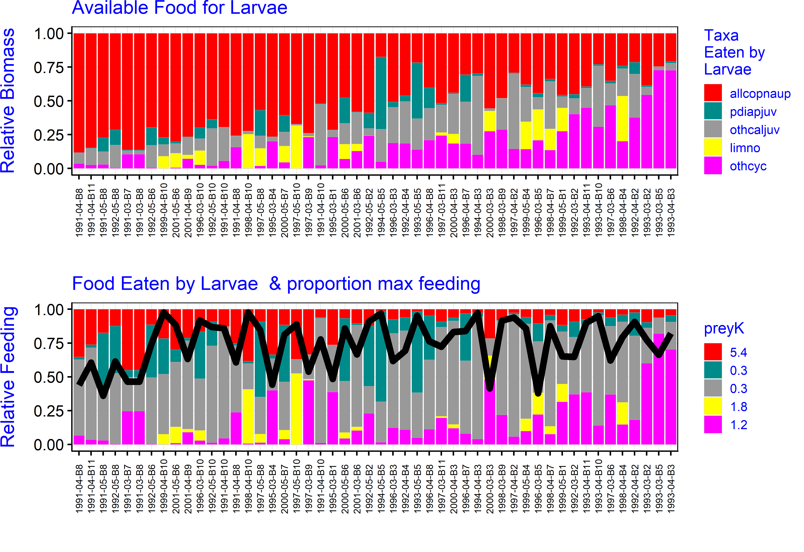
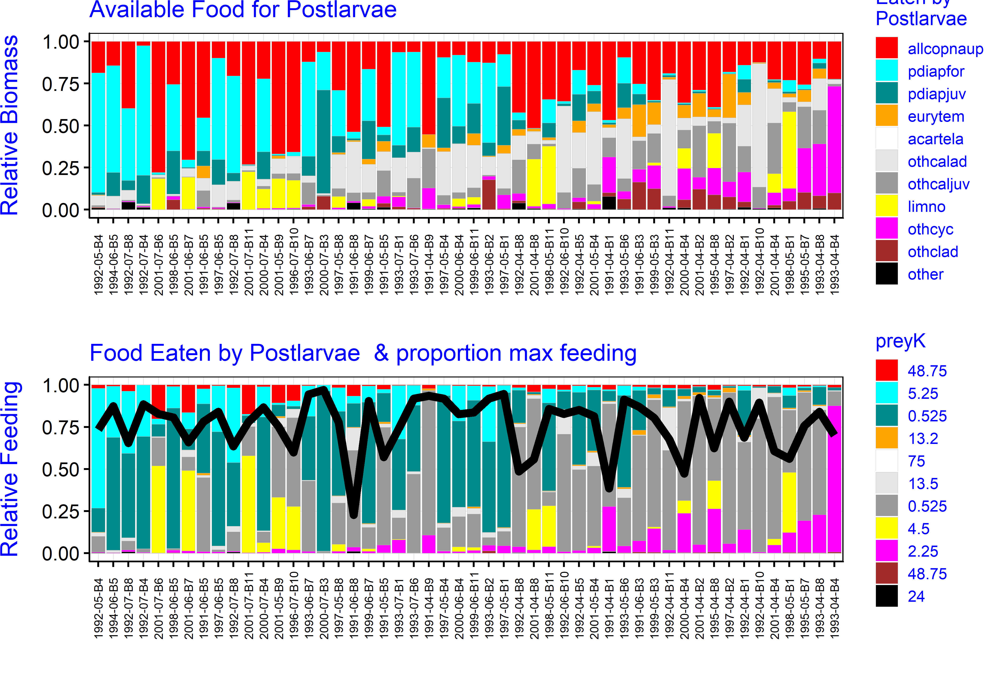
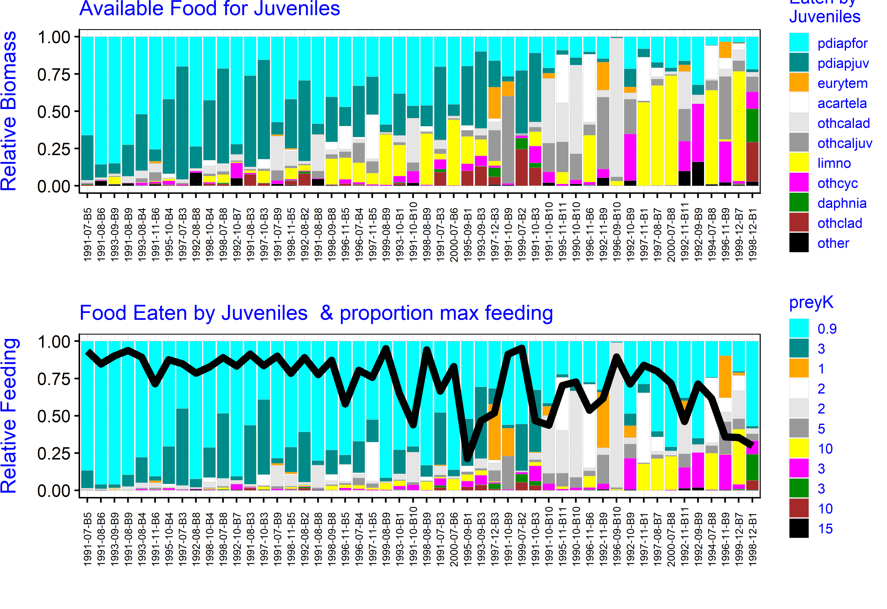
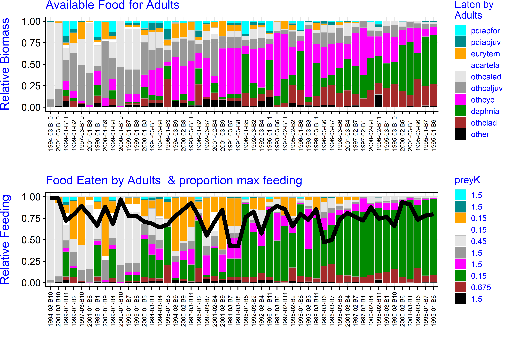
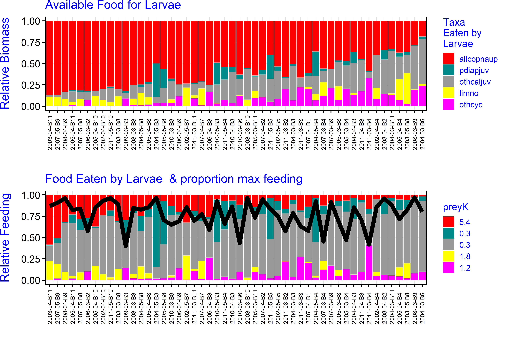
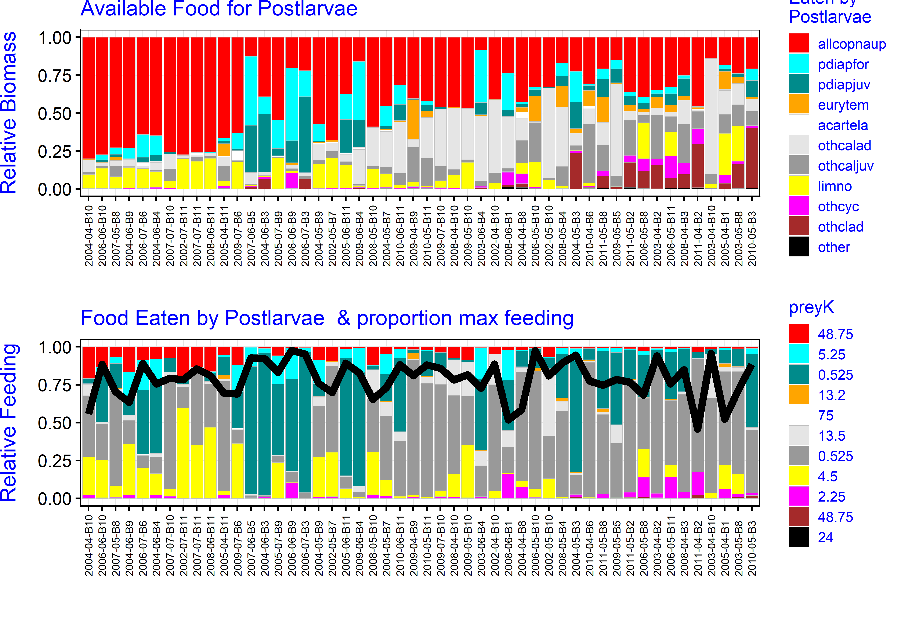
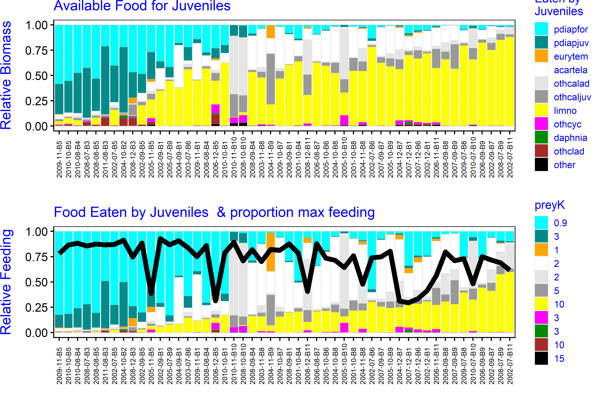
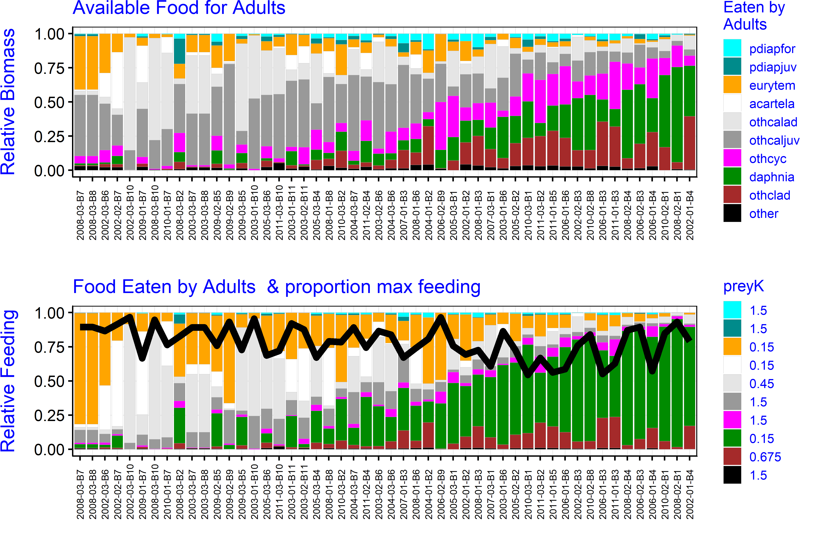

**Methods for preparing zooplankton data for model input**

**Revised 12/27/2019**

The methods used to populate the previous version of the model with
inputs of zooplankton food for delta smelt (Appendix A in Rose et al.
2013a) have been altered in various ways to accommodate the objectives
and design of this project (Table 1). In the previous version,
zooplankton in six taxonomic groups were used to represent food of delta
smelt. Data on abundance (number m^-3^) were obtained from the
Interagency Ecological Program zooplankton monitoring database and the
CDFW 20-mm survey. The zooplankton program has collected zooplankton
abundance data monthly at 16–22 stations during the period represented
by the model of 1995–2005. The 20-mm survey has sampled at 49–52
stations each year, generally during March or April to July. These were
used with estimates of carbon mass per individual to obtain estimates of
biomass (mgC m^-3^) for each taxon (species or higher taxonomic level)
and major life stage. Data for each taxon, spatial box, and sampling
date were increased by a small number (to allow for zeros),
log-transformed, and averaged. Then data were interpolated to each date
in the model run by the use of a moving window of 45 days on each side
of the date and averaging all values within that window for the taxon
and box. A similar process was used to determine standard deviations.

Our expansion of the spatial and temporal frame of the model, together
with new information about delta smelt and their habitat, led us to
reconsider the sources of data and the method of converting the
available data to model input.

*Objective*: to extend the time frame of the zooplankton data to include
water years 1991 through 2011, incorporate all available zooplankton
data, expand the zooplankton groups, improve the method of assigning
values to boxes, and revise the parameters for prey consumption as a
step in the calibration process.

*Overview*: Data on zooplankton abundance were obtained from all
available data sets from ongoing monitoring, and converted to biomass
using previously determined carbon masses per individual by species and
life stage (Fig. 1). Taxa were assigned to one of 12 taxonomic and life
stage prey groups (“taxa”), and stations were assigned to spatial boxes
in the IBM. Biomass data were converted to matrices of proportion zero
catch and log mean of non-zero data, for each day of the simulation,
spatial box, and taxon for input to the IBM. Then the parameters of the
functional response of the four major delta smelt life stages were
determined iteratively to give reasonable proportions of prey taxa
consumed and gave a mean overall consumption rate of 75% of maximum
during the calibration period (Fig. 2). These parameters were also used
as input to the IBM.

*Data sources:* Zooplankton data are available from four monitoring
programs (Tables 1, 2). The three fish-monitoring programs take
zooplankton samples mainly to provide information for studies of fish
diets. The durations, seasons, and stations differ among these programs,
and in particular the spatial extent of these programs differs widely.
Sample collection and processing is more consistent among the programs,
with a slightly larger mesh size used in the three fish programs, and
some slight differences in sample processing and levels of species
identification. In the zooplankton monitoring program an additional pump
sample is taken to collect the smaller fraction (45–154 µm), which is
the only suitable source of data for two of the prey taxa, copepod
nauplii and *Limnoithona* spp.

Taxon codes in the three fish programs are based on those in the
longer-running zooplankton program, so for most taxa there is no
ambiguity. However, the level of identification differs somewhat among
programs and has changed through time in all programs, presenting a
challenge for finding a common description of the zooplankton
assemblage. Adult copepods are usually (not always) identified to
species, while juveniles are usually identified to genus; for most
genera there is only one abundant species in the model domain.

*Data processing*: Processing the data required two principal steps:
assembling the data sets and reconciling differences in identification.
The data are available from CDFW through an FTP site (accessible through
<http://wdl.water.ca.gov/iep/products/data.cfm>). The zooplankton data
are provided as Excel files for each of the sampling gears. The fish
data and associated zooplankton data are in Microsoft Access files. For
analysis I exported all tables and imported them into R, then saved the
data as lists of data tables in .Rdata files and wrote query functions
to extract the data of interest from these lists. This resulted in
smaller files and easier queries than available in Access. Data from the
summer townet and fall midwater trawl surveys have identical formats, so
these were combined.

We reconciled taxon names among sampling programs by merging the taxon
lists from all programs and then examining the resulting table for taxa
that were missing from one or two of the three data sets. These were
adjusted as follows: 1) If one name was used for different taxa among
data sets, the name was changed in one or two data sets to match the
other(s); 2) If the taxon was either too large (e.g., mysids) or too
small (e.g., rotifers) to be collected quantitatively in the net
samples, the taxon was eliminated; or 3) If the taxon was described at
different levels of resolution in different data sets, the coarser level
of resolution was used.

Small forms such as copepod nauplii and small copepods (e.g.,
*Limnoithona* sp.) are collected int the zooplankton program using a
pump sampler. Although these are also reported by the fish-monitoring
programs, the nets used do not collect them quantitatively so data for
these taxa were taken only from the pump data taken by the zooplankton
program. Data for large and small zooplankton were processed separately
because of the large difference in sampling density.

*Stations:* The association between fixed stations and boxes was
determined previously for Rose et al. (2013a), except that we removed
the Cache Slough complex from Box 1 (upper Sacramento) and placed it in
new Box 12. Stations were assigned to boxes they were in and also to
nearby boxes to increase the number of data points for each sampling day
(see Appendix in Rose et al. 2013a).

Starting in 1994 the zooplankton monitoring program has also visited
movable stations, one at salinity \~1 and the other at salinity \~3.2.
When these salinities were found in the Delta, samples were taken in the
Sacramento River, except that beginning in 2014 samples were also taken
at these salinities in the San Joaquin River. One or more of these
stations are omitted if the salinity at a fixed station (the substitute)
is close to the target value. Beginning in 2004 the coordinates of the
movable stations and any substitute station were listed in a series of
spreadsheets. We eliminated movable stations that had a substitute (to
avoid double-counting data) and used these coordinates to assign each
movable station to the nearest box.

For data before 2004 we compared the salinity recorded for the movable
stations with that recorded at fixed stations in the same survey, and
eliminated four data points from movable stations where the salinity
matched . Then for each survey we constructed a relationship of salinity
vs. distance up the axis of the estuary (km) and interpolated to convert
salinity recorded at the movable stations to distance. This was then
used to assign the movable stations to boxes. In four cases salinity was
not recorded at any station, and these four values were dropped.

**Selecting taxonomic groups**

Equation 10 in Rose et al. (2013a) specifies the realized ingestion rate
of a given prey group by an individual fish, rearranged here:

(1)

where C~j~' is the ratio of ingestion rate to the maximum C~max~ scaled
to the weight of the fish W; that is, C~j~' is a measure of the
“success” of the fish because the growth rate of the fish will be
maximized when C~j~' is 1. Z~j~ is biomass of taxon j, V~j~ is
vulnerability, a switch (0 or 1) to turn feeding on the species group on
or off, and K~j~ is the half-saturation constant. Subscripts j refer to
the individual prey group, which may be one or more life stages,
species, or other groupings, and k refers to all prey groups. With only
one prey group Eqn. 2 reduces to the familiar Holling Type II functional
response, a rectangular hyperbola, in which the maximum is 1 and the
half-saturation constant is K~j~.

If two or more species groups have the same V and K parameters, total
mass consumption by a fish does not change if the groups are entered
individually or combined. Therefore species groups need be entered
separately only if their parameters differ for any life stage of delta
smelt. Other groups may also be entered separately for convenience
during calibration or when comparing among time periods (above), boxes,
or sampling programs.

The criteria for selecting taxonomic groups and either lumping them or
keeping them separate are:

1.  Relatively abundant during at least part of the model period.

2.  Abundant in all sampling programs or in one or more boxes.

3.  Known or likely difference in feeding parameters for any delta smelt
    life stage

4.  Different spatial and temporal distributions from other taxa that
    could affect delta smelt

5.  No more than 12 prey groups

    Based on these criteria we selected 12 zooplankton groups (Table 3).
    Copepods include adults of two species, adults and juveniles of two
    species combined (*Limnoithona* spp.), juveniles of three species
    (*Pseudodiaptomus* spp.), other calanoid adults and juveniles, other
    cyclopoids, and copepod nauplii (larvae). Additional taxa are
    *Daphnia* spp. cladocera, other cladocera, and other taxa.

    **Developing master zooplankton data set**

    The sampling programs report abundance (number m^-3^) based on
    counts of subsamples. I converted these to biomass using carbon mass
    measured on several adult copepods and other taxa (e.g., Kimmerer
    2006, Gould and Kimmerer 2010, Kimmerer et al. 2017). Copepodites
    (juvenile copepods) were assumed to have about 25% of the carbon
    mass of adults based on their median life stage (copepodite 3) and
    the ratios of copepodite to adult masses for several species
    discussed in the above references. Masses for several other taxa
    were estimated from their size using literature values.

    *Large zooplankton* were collected with 154–160 µm mesh nets towed
    obliquely through the water column. I used the combined data from
    all zooplankton monitoring studies. The first steps were to remove
    taxa that were not reported in the EMP zooplankton database and
    those with a mean biomass among all samples less than 0.05 mgC
    m^-3^. Then I examined the biomass of each taxon in the three
    databases, as well as biomass in the low-salinity zone and the Cache
    Slough complex. There was general agreement among the databases and
    locations for most taxa.

Biomass data were natural-log-transformed with zeros in the original
data flagged and replaced with a value of -5 which is below the minimum
non-zero value. Data for each box, taxon, and sampling date were placed
in two arrays, the first containing the log-transformed data excluding
zeros (or -5 if all were zero). The second array contained a value of 1
for each zero value in the raw data. Then data in each array were
averaged across all samples within a box, taxon, and date, though not
all dates had complete samples. In addition box 12 was sampled only
beginning in 1995, and then only in the southern portion of the box and
during spring. In 2005 additional sampling began in summer–fall.

To fill out the data for Box 12 I first examined the data for
correlations among boxes. Biomass in boxes 2-5 had strong relationships
with that in Box 12, depending on the taxon. We therefore calculated
models in which Box 12 biomass was modeled as a linear combination of
data from Boxes 2-5. These models were used to predict the mean of the
log-transformed non-zero values for Box 12 when data were missing. The
proportion of zeros could not be modeled this way because much of the
available data in Box 12 comprised only a single sample, but all the
taxa had strong seasonal patterns of presence/absence. Therefore for
each taxon we modeled the proportion of zeros as a smoothed function of
julian day with a binomial error distribution (function *gam* in R
package *mgcv*) and used that to predict the proportions of zeros for
each taxon.

The next step was to extend the data for each sampling event in each box
into each day of the model period. As before (Rose et al. 2013a) we
applied a moving window of ± 45 d around each date, and calculated means
of all non-missing data for a given box and taxon within that window.
Because sampling ceased during winter of 1989–1993, gaps in the data
were too wide to be filled by the moving window, so I interpolated the
data linearly across the gaps. Then the data were exported as individual
files for each taxon, each of which contained the year, julian day, and
for each box either the mean log biomass or the proportion of zeros. The
data are then used in the IBM by taking antilogs, then sampling from a
binomial distribution using the proportion of zeros to get the
probability of getting a zero; if a uniform (0,1) random number exceeds
this probability the result is set to zero.

*Small zooplankton* (collected with a pump, EMP only): The pump sample
is filtered through a 154 µm mesh before it is concentrated at 45 µm for
counting, so the values (m^-3^) calculated from counts of the net and
the pump samples are considered additive. The pump collects mostly
rotifers, nauplii, and small copepods such as *Limnoithona* spp.
Rotifers have been uncommon in the estuary since the late 1980s, and
have not been reported as common in delta smelt. Copepod nauplii have
not been consistently identified to genus or species, so they formed a
discrete group, and *Limnoithona* another one from the small
zooplankton.

Data for small zooplankton were analyzed as above, except that data were
available for fewer dates, so a 60-day window was used for
interpolation. Also no monitoring data for small zooplankton have been
gathered in the Cache Slough complex, so the means of Boxes 4 and 5 were
used to populate Box 12.

**Feeding rate parameters and outcomes**

Values of preyK and preyV (Eqn. 1, Fig. 2) were determined iteratively
to achieve three objectives: 1) Set the mean proportion of maximum
feeding among all samples in the calibration period (WY 1991-2001) at
about 75%; 2) Prevent fish from eating prey they are not found to eat at
their life stage, probably because the prey are too large or too small;
and 3) Have the model fish eat prey in approximate proportion to the
available data on food consumption. This was done in R by box and
sampling date; because I did not weight boxes by smelt abundance this
method does not constitute a calibration of food consumption within the
IBM but is meant to provide a starting point for that calibration.

A data set of prey availability was constructed by selecting each
sampling event during the calibration period (water years 1991–2001)
when both large and small zooplankton were collected (i.e., the IEP-EMP
sampling events) and calculating the biomass of each prey type from each
event in each box. These excluded Box 12 because no small-zooplankton
samples have been taken there, and that region has not been sampled for
most of the period of record. The data for each sample date, box, and
taxon included the mean natural log of biomass (zeros excluded) and the
proportion of zeros. Antilogs of the means were enhanced by half of the
variance (0.84^2^/2) to account for the skewness in the lognormal
distribution. Then the antilog values were multiplied by the proportion
of zeros in the raw data. The values resulting from this calculation
were used to calculate feeding by each life stage for months when these
life stages were abundant in the model: March–May (larvae), April–July
(post-larvae), July–December (juveniles), and January–March (adults).

First the preyV values were set to limit the range of prey for each life
stage. We assumed that larvae could not feed successfully on adult
calanoid copepods or any cladocerans (Nobriga 2002), that post-larvae
could consume all prey except the large cladoceran *Daphnia*, and
juveniles could consume all prey except copepod nauplii (Nobriga 2002).
We assumed that adults also would not eat nauplii, and would rarely
detect the small, cryptic cyclopoid copepod *Limnoithona* spp., which in
any case is not very abundant before March when abundance of adult smelt
declines.

Then the preyK values were adjusted to make the proportions of each
taxon in the diets reflect the proportions shown in the literature on
delta smelt diets by life stage (Feyrer et al. 1993, Lott 1998, Nobriga
2002, Baxter et al. 2010, and Slater and Baxter 2014). Most of these
data are aggregated across dates and locations, and some are for gut
contents only and corresponding plankton counts are not reported.
Therefore comparisons of model output to information in these reports
were qualitative, and done by life stage within their season of
abundance since both the life stages and the composition of the ambient
zooplankton have a strong seasonal pattern.

Initial guesses at the preyK values were based on the calibration of
Rose et al. (2013a), expanded to include the additional taxa. I adjusted
these iteratively by changing values by small amounts, then comparing
proportional consumption with literature reports. Then the preyK values
with non-zero preyV values for each stage (i.e, the prey that could be
consumed by the stage) were adjusted up or down proportionally until the
mean value of the proportion of maximum consumption (C~j~' in Eqn. 1)
was close to 0.75. These preyK values (Table 4) were then used in a
similar analysis for the validation period, and as initial input to the
IBM.

The realized consumption rates for the calibration period were close to
the target but with wide ranges, especially for the younger stages
(Table 5, Fig. 3). The statistics changed only slightly when the
zooplankton data from the validation period was used (Table 5).
Differences among boxes are apparent, likely a result of spatial
patterns in abundance of zooplankton taxa with low preyK values; for
example, values for larvae and postlarvae in Box 1 (Sacramento River)
were generally lower than those in other boxes, reflecting dilution of
zooplankton during the low-flow spring and early summer. Values for
juveniles were generally higher in boxes 1–5 than in boxes 7-11,
reflecting low abundance of adult and juvenile *P. forbesi* (see below).

To examine feeding by prey type with the selected values of preyK (Eqn.
1) I took 50 random samples from data for each life stage, sorted the
samples to make adjacent samples most similar in relative prey
composition, and plotted the proportions by biomass of each taxon in the
available prey and in the calculated daily consumption by taxon from
Eqn. 1.

Figures 4–7 show the proportions of biomass available and proportions
eaten by taxon for each life stage of delta smelt, including only prey
taxa with preyV=1 for a given life stage. The food available to larvae
(Fig. 4) was dominated by copepod nauplii and juvenile copepods. The
larvae consumed mainly juvenile copepods, primarily *P. forbesi* and
other calanoids. Post-larvae are able to consume a larger array of prey
types than larvae (Fig. 5); the more diverse prey field contained high
proportions of copepod nauplii, juvenile and adult copepods, and some
cladocerans, but the fish ate mostly juvenile copepods. The juvenile
prey field was also diverse, partly because of seasonal decreases in
abundance of warm-water species such as *P. forbesi* (Fig. 7).
Consumption was similarly diverse though it emphasized adult copepods
when they were available, especially *P. forbesi,* and total consumption
was positively related to abundance of *P. forbesi.* The diets included
some cladocerans and *Limnoithona* when there was little else to eat,
which is consistent with gut-content data (Slater and Baxter 2014). The
food availability in late winter-early spring when adults were present
was much richer in cladocerans such as *Daphnia*, substantial
proportions of cyclopoid copepods, and some calanoids. Adults (Fig. 7)
consumed mainly adult calanoids and *Daphnia* spp., feeding at the
larger end of the prey spectrum.

Feeding during the validation period resulted in similar overall
consumption rates (Figs. 8–11) but prey availability and therefore
feeding during the validation period was rather different because of
shifts in the prey abundance patterns. For postlarvae adult copepods
made up a lower proportion of the available prey, and nauplii a higher
proportion, than during the calibration period, but proportions of
consumption of the prey were not much different between the two periods
because parameters for postlarvae were set so they did not eat many
nauplii. The prey available to juveniles was very different during
validation than calibration, with a much higher proportion of
*Limnoithona* and *Acartiella* at the expense of *P. forbesi*. These
differences are reflected in the proportions consumed. For adults the
principal difference in the prey field was a lower proportion of
cyclopoids and a higher proportion of calanoids, so that consumption was
about split between calanoids and cladocerans.

The longer-term feeding picture (Figs. 12, 13) shows high variability in
space and time. In the Delta the Sacramento box often had the lowest
feeding rate, which is consistent with the low zooplankton abundance
owing to dilution by river flow. The Delta does not show a consistent
downward trend across life stages, and for juveniles, feeding was more
consistent and usually somewhat higher after the early 1990s than
before. In Suisun Bay there were several years of very low feeding
around 1990, and after that a consistently lower feeding rate for
juveniles than before that period. Suisun Marsh (Box 9) was somewhat
anomalous in its pattern.

Table 1. Changes made to algorithm for assigning zooplankton abundance
to boxes.

  -----------------------------------------------------------------------------------------------------------------------------------------------------------------------------------------------------------------------
  **Feature**             **Rose et al. 2013a**                                                  **Changes in current version**
  ----------------------- ---------------------------------------------------------------------- ------------------------------------------------------------------------------------------------------------------------
  Time frame              1995–2005                                                              Water years 1991–2001 for calibration, 2001–2011 for validation

  Number of taxa          6                                                                      10 large 2 small

  Method for zero catch   e^-8^ for large zoops, e^-4^ small so data could be log transformed.   Zero-inflated method with two parameters per box & day: mean of ln(biomass) for non-zero values, and proportion zeros.

  Standard deviation      Calculated and expanded as for mean                                    Constant value of 0.84 based on data

  Number of boxes         11                                                                     12 with CSC split off from Box 1 (Sac)

  Stations included       41 from 20mm, 29 EMP                                                   51 from 20mm, 45 TNS, 41 MWT,
                                                                                                 
                                                                                                 30 EMP + \~30 salinity-based stations/year starting 1994

  EMP sampling            Monthly sampling                                                       Before 1989 EMP sampled twice monthly but not in winter.
                                                                                                 
                                                                                                 1990-1993 throughout year; from 1994 monthly at \~40% of stations, and added 2–4 salinity-based stations.

  20mm sampling           Consistent                                                             Box 12 1 station 1995, up to 12 by 2011

  TNS sampling            NA                                                                     Started in 2005

  MWT sampling            NA                                                                     Started in 2005

                                                                                                 

                                                                                                 
  -----------------------------------------------------------------------------------------------------------------------------------------------------------------------------------------------------------------------

~\
~

Table 2. Characteristics of data sources for zooplankton abundance. All
programs continue, but years listed include all for which data were
available in May 2017.

  Source                       Years        Months      Stations     Net mesh   Small zoops
  ---------------------------- ------------ ----------- ------------ ---------- -------------
  Zooplankton monitoring       1972–2017    Jan–Dec\*   37 ( 6–60)   154 µm     45–154 µm
  20mm survey                  1995–2016    Mar–Aug     41 ( 5–52)   160 um     —
  Summer townet survey         2005­–2015   Jun–Aug     32 ( 9–32)   160 um     —
  Fall midwater trawl survey   2005­–2015   Sep–Dec     32 (23–40)   160 um     —

\* Mar–Nov in 1972–1976 and 1984–1994

Table 3. Zooplankton taxonomic groups and links to individual taxa. The
size class is based on either sampling with a net (Large) or pump
(Small). Species code is that used in the EMP zooplankton monitoring
program. Taxon names are the species codes unless the group includes
&gt;1 code.

  Size class   Species code   Genus               Species          Taxon name   Comments
  ------------ -------------- ------------------- ---------------- ------------ ---------------------------------------------------------------------------------------------------------------------------------
  Large        acartela       *Acartiella*        *sinensis*       acartela     Prominent in diets in late summer (Start 1994)
               daphnia        *Daphnia*           spp.             daphnia      Very abundant in freshwater
               eurytem        *Eurytemora*        *affinis*        eurytem      Historically abundant, still common in spring
               pdiapfor       *Pseudodiaptomus*   *forbesi*        pdiapfor     Most common prey (Starting 1989)
               pdiapjuv       *Pseudodiaptomus*   spp.             pdiapjuv     Second most abundant zoop group (Starting 1990)
               acartia        *Acartia*           spp.             othcalad     Other calanoid adults. These collectively are important prey but no particular species is that abundant in delta smelt habitat.
               diaptom        *Diaptomus*         spp.             othcalad     
               osphran        *Osphranticum*      *labronectum*    othcalad     
               pdiapeu        *Pseudodiaptomus*   *euryhalinus*    othcalad     
               pdiapmar       *Pseudodiaptomus*   *marinus*        othcalad     
               sinocal        *Sinocalanus*       *doerrii*        othcalad     
               tortanus       *Tortanus*          sp.              othcalad     
               othcalad                                            othcalad     
               acarjuv        *Acartia*                            othcaljuv    Other calanoid copepodites - as for other calanoid adults.
               asinejuv       *Acartiella*                         othcaljuv    
               diaptjuv       *Diaptomus*                          othcaljuv    
               euryjuv        *Eurytemora*        *affinis*        othcaljuv    
               sinocaljuv     *Sinocalanus*                        othcaljuv    
               tortjuv        *Tortanus*                           othcaljuv    
               othcaljuv                                           othcaljuv    
               avernal        *Acanthocyclops*    *vernalis*       othcyc       Cyclopoid copepods (all stages) can be abundant at times and occur in delta smelt guts.
               oithdav        *Oithona*           *davisae*        othcyc       
               oithsim        *Oithona*           *similis*        othcyc       
               oithspp        *Oithona*           spp              othcyc       
               cycjuv                                              othcyc       
               othcycad                                            othcyc       
               bosmina        *Bosmina*           *longirostris*   othclad      Other cladocera can be abundant at times.
               ceriodap       *Ceriodaphnia*      spp.             othclad      
               diaphan        *Diaphanosoma*      spp.             othclad      
               othclado                                            othclad      
               harpact                                             other        Other taxa to complete the list
               annelid                                             other        
               barnnaup                                            other        
               chironomid                                          other        
               crabzoea                                            other        
               cumac                                               other        
               ostrac                                              other        
  Small        limno          *Limnoithona*       spp.             limno        Extremely abundant, sometimes eaten (Start 1994)
               allcopnaup                                          copnaup      Copepod nauplii eaten by larvae

Table 4. Calibrated values of preyK, left blank where preyV is zero. At
any prey concentration, higher levels of preyK correspond to lower
feeding rates. These values were used in all subsequent analyses

  Taxonomic group                                                   preyK values for all preyV not 0
  ----------------- -- -------------------------------------------- ---------------------------------- ------------- ----------- --------
                       Description                                  Larvae                             Post-larvae   Juveniles   Adults
  acartela             *Acartiella sinensis* (copepod) adults                                          75            2           0.15
  eurytem              *Eurytemora affinis* (copepod) adults                                           13            1           0.15
  pdiapfor             *Pseudodiaptomus forbesi* (copepod) adults                                      5.2           0.9         1.5
  othcalad             Other calanoid copepod adults                                                   13            2           0.45
  pdiapjuv             *Pseudodiaptomus forbesi* copepodites        0.3                                0.5           3           1.5
  othcaljuv            Other calanoid copepodites                   0.3                                0.5           5           1.5
  limno                *Limnoithona* spp. copepods (all stages)     1.8                                4.5           10          13.5
  othcyc               Other cyclopoid copepods (all stages)        1.2                                2.2           3           1.5
  allcopnaup           Copepod nauplii (all spp.)                   5.4                                50                        
  daphnia              *Daphnia* spp. (cladocerans)                                                    75            3           0.15
  othclad              Other cladocerans                                                               50            10          0.7
  other                All other taxa                                                                  24            15          1.5
                                                                                                                                 

Table 5. Summary statistics for maximum proportional feeding rate (Eqn.
1) using parameters in Table 4. Parameters preyK for the calibration
period were adjusted to get a mean proportional feeding rate of \~0.75.
Parameters were then used for the validation period without adjustment.
N is total number of samples, and all maxima were over 0.97.

  -------------------- ----- ------------- -------- ---------
  Calibration period
  Larvae
  Post-larvae
  Juveniles
  Adults
  Validation period
  Larvae
  Post-larvae
  Juveniles
  Adults

Figure 1. Flow diagram summarizing the process for preparing zooplankton
biomass data for input to the IBM. Each text box represents a process,
and blue gridded boxes represent matrices or arrays of data.

{width="6.339901574803149in" height="7.15in"}

Figure 2. Flow diagram summarizing the process for determining preyV and
preyK values for input to the IBM. Shapes as in Fig. 1.
{width="6.005217629046369in"
height="8.058333333333334in"}

Figure 3. Boxplot of the proportion of maximum consumption (C~j~' in
Eqn. 1) by spatial box by delta smelt life stage for the calibration and
validation periods.

{width="6.8125in"
height="4.6819444444444445in"}

Figure 4. Calibration period. Prey available and feeding by larval delta
smelt. Upper panel shows relative biomass of prey taxa and lower panel
shows relative feeding on each taxon, with the heavy line indicating the
proportion of maximum consumption (C~j~' in Eqn. 1). Data were randomly
selected from the total available (Table 5) and ordered to keep similar
samples close together. Labels on the X axis denote year-month-Box.
Taxon names are identified in Table 3.

{width="7.509922353455818in"
height="5.159722222222222in"}

Figure 5. As in Fig. 4 for postlarvae.

{width="7.550352143482065in" height="5.1875in"}

Figure 6. As in Fig. 4 for juveniles.

{width="7.530136701662292in"
height="5.173611111111111in"}

Figure 7. As in Fig. 4 for adults.

{width="7.520029527559055in"
height="5.166666666666667in"}

Figure 8. As in Fig. 4 for larvae in the validation period.

{width="7.504780183727034in"
height="5.156522309711286in"}

Figure 9. As in Fig. 4 for postlarvae in the validation period.

{width="7.466813210848644in"
height="5.130435258092739in"}

Figure 10. As in Fig. 4 for juveniles in the validation period.

{width="7.5047779965004375in"
height="5.156521216097988in"}

Figure 11. As in Fig. 4 for adults in the validation period.

{width="7.530089676290464in"
height="5.173912948381452in"}

Figure 12. Fraction of maximum feeding rate vs. year by life stage for
Delta (boxes 1-6) and Suisun Bay and Marsh. Values are means by year for
the season of abundance of the life stage.

{width="7.558217410323709in"
height="5.194444444444445in"}\
Figure 13. Data in Fig. 12 arranged as boxplots for three time periods
reflecting major periods of change in the estuarine food web.

{width="7.5582163167104115in"
height="5.194444444444445in"}
